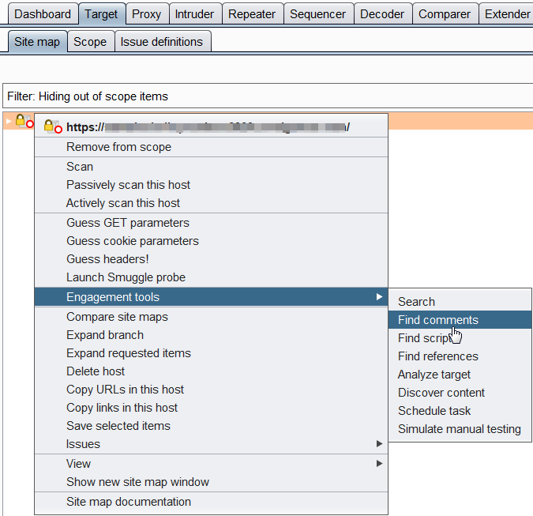
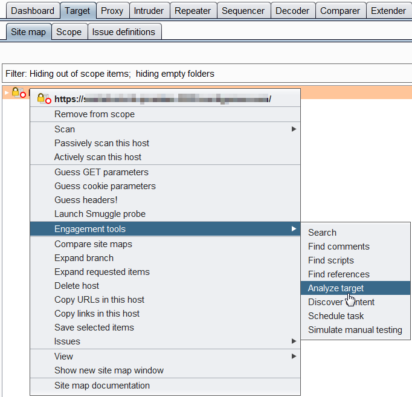
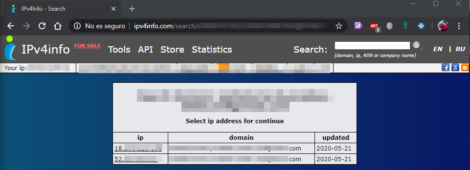

# \[CONFIG\] GESTIÓN DE CONFIGURACIÓN E IMPLEMENTACIÓN


### CONFIG-01 Configuración de infraestructura/red

🎯 **Objetivo**

Buscar información sensible sobre la aplicación, sistema u organización que pueda estar expuesta tanto directamente \(en el sitio web de la organización\) o indirectamente \(sitio web de un tercero\).

📝 **Pruebas**

* [ ] Buscar información sobre la aplicación en Google, Bing, GitHub, Shodan, Censys, Pastebin, Hunter, LinkedIn, Facebook y Twitter.
* [ ] Comprobar fugas de información en leaks.
* [ ] Lanzar **waybackurls**.
* [ ] Comprobar emails en **hunter.io**.
* [ ] Comprobar dominio en **shodan.io**.
* [ ] Comprobar dominio en **binsearch.info**.

**Google**

```text
site:[DOMAIN]
cache:[DOMAIN]
filetype:[EXTENSION]
inurl:[DORK]
intext:[DORK]
inbody:[DORK]
intitle:[DORK]
```

**Archive**

```text
https://web.archive.org/web/*/[DOMAIN]/*
```

```text
waybackurls [DOMAIN] | tee -a [DOMAIN].txt
```

**Hunter.io**

```text
https://hunter.io/search/[DOMAIN]
```

**Shodan.io**

```text
https://www.shodan.io/search?query=[DOMAIN]
```

**Binsearch.info**

```text
https://binsearch.info/?q=[DOMAIN]
```

🌐 **Referencias**

* [OWASP GitHub INFO-01](https://github.com/OWASP/wstg/blob/master/document/4-Web_Application_Security_Testing/01-Information_Gathering/01-Conduct_Search_Engine_Discovery_Reconnaissance_for_Information_Leakage.md)
* [Google Hacking Database/](https://www.exploit-db.com/google-hacking-database/)

### CONFIG-02 Configuración de la plataforma de la aplicación

🎯 **Objetivo**

Buscar información sobre la versión y tipo del servidor web para buscar posibles vulnerabilidades y exploits.

📝 **Pruebas**

* [ ] Navegar por la aplicación y observar cabeceras.
* [ ] Analizar el código HTML.
* [ ] Observar las cookies.
* [ ] Lanzar **Wappalyzer**.
* [ ] Lanzar **Whatweb**.
* [ ] Lanzar **Netcraft**.

**Wappalyzer**

```text
wappalyzer [URL] --user-agent "Mozilla/5.0 (Windows NT 10.0; Win64; x64) AppleWebKit/537.36 (KHTML, like Gecko) Chrome/84.0.4135.1 Safari/537.36" --proxy "http://127.0.0.1:8080" --recursive --pretty >> [DOMAIN].json
```

**Whatweb**

```text
whatweb --aggression 4 --user-agent "Mozilla/5.0 (Windows NT 10.0; Win64; x64) AppleWebKit/537.36 (KHTML, like Gecko) Chrome/84.0.4135.1 Safari/537.36" --proxy "127.0.0.1:8080" --url-prefix "https://" [DOMAIN]
```

**Netcraft**

```text
https://sitereport.netcraft.com/?url=[URL]
```

🌐 **Referencias**

* [OWASP GitHub INFO-02](https://github.com/OWASP/wstg/blob/master/document/4-Web_Application_Security_Testing/01-Information_Gathering/02-Fingerprint_Web_Server.md)

### CONFIG-03 Fugas de información sensible en el manejo de extensiones de archivos

🎯 **Objetivo**

Buscar archivos o directorios que puedan contener información interesante o sensible.

📝 **Pruebas**

* [ ] Comprobar el archivo `robots.txt`.
* [ ] Observar el tag HTML `META`.
* [ ] Lanzar crawl con Burp Suite.
* [ ] Lanzar **gobuster** con directorios conocidos.
* [ ] Lanzar **wfuzz** con ficheros conocidos.

**Wget**

```text
wget [URL]/robots.txt
```

**Curl**

```text
curl -O [URL]/robots.txt
```

**Gobuster**

```text
gobuster -w "/usr/share/wordlists/dirbuster/directory-list-2.3-medium.txt" -t 23 dir -u "[URL]" -o directories.txt
```

```text
gobuster -w "/usr/share/wordlists/dirb/common.txt" -t 23 -x php,txt,html dir -u "[URL]" -o common_files.txt
```

**Wfuzz**

```text
wfuzz -c -t 23 -w "/usr/share/wordlists/dirb/common.txt" -z "php,txt,html" -u "[URL]FUZZ"
```

🌐 **Referencias**

* [OWASP GitHub INFO-03](https://github.com/OWASP/wstg/blob/master/document/4-Web_Application_Security_Testing/01-Information_Gathering/03-Review_Webserver_Metafiles_for_Information_Leakage.md)

### CONFIG-04 Fugas de información sensible en archivos obsoletos, de backup o no referenciados

🎯 **Objetivo**

Enumerar las aplicaciones dentro del alcance de la auditoria y presentes en el mismo servidor \(Host compartido\), descubrimiento de puertos abiertos, servicios, subdominios o frameworks utilizados.

📝 **Pruebas**

* [ ] Utilizar el motor de búsqueda **bing** con el filtro `IP:`.
* [ ] Comprobar en `http://ipv4info.com`.
* [ ] Lanzar **Nmap**.
* [ ] Lanzar **Wfuzz**.
* [ ] Lanzar **Assetfinder**.
* [ ] Lanzar **Amass**.
* [ ] Lanzar **Sublist3r**.

**Bing**

```text
https://www.bing.com/search?q=IP%3A[IP]
```

**IPv4info**

```text
http://ipv4info.com/search/[DOMAIN]
```

**Nmap**

```text
nmap -p- --open -T2 -v -oA ports [DOMAIN]
```

```text
nmap -sC -sV -T2 -v -oA services -p[PORTS] [DOMAIN]
```

**Wfuzz**

```text
wfuzz -c -t 23 -w "/usr/share/wordlists/SecLists/Discovery/DNS/subdomains-top1million-20000.txt" -H "Host: FUZZ.[DOMAIN]" -u "[URL]"
```

**Assetfinder**

```text
assetfinder --subs-only [DOMAIN] | tee -a assetfinder.txt
```

**Amass**

```text
amass enum -passive -d [DOMAIN] -o amass-pasive.txt
```

```text
amass enum -brute -d [DOMAIN] -o amass-brute.txt
```

**Sublist3r**

```text
python sublist3r.py -d [DOMAIN] -v -o sublister.txt
```

🌐 **Referencias**

* [OWASP GitHub INFO-04](https://github.com/OWASP/wstg/blob/master/document/4-Web_Application_Security_Testing/01-Information_Gathering/04-Enumerate_Applications_on_Webserver.md)

### CONFIG-05 Enumeración de infraestructura e interfaces de administración de la aplicación

🎯 **Objetivo**

Buscar fugas de información en comentarios HTML y metadatos de archivos subidos al servidor.

📝 **Pruebas**

* [ ] Una vez explorada la aplicación mediante **Burp Suite**, exportar los comentarios desde la pestaña `Target -> Site map -> Engagement tools -> Find comments`.
* [ ] Plugin para Burp Suite: [Exiftool Scanner](https://github.com/portswigger/exiftool-scanner).
* [ ] Almacenar los archivos obtenidos y descargados durante la auditoria para analizarlos con **FOCA**.

**Burp Suite**



🌐 **Referencias**

* [OWASP GitHub INFO-05](https://github.com/OWASP/wstg/blob/master/document/4-Web_Application_Security_Testing/01-Information_Gathering/05-Review_Webpage_Content_for_Information_Leakage.md)

### CONFIG-06 Métodos HTTP

🎯 **Objetivo**

Comprender como se forman las peticiones y respuestas de la aplicación, buscar puntos de entrada y parámetros ocultos.

📝 **Pruebas**

* [ ] Comprender como están formadas las peticiones y respuestas.
* [ ] Identificar en que puntos de la aplicación se usan los métodos POST y GET.
* [ ] Conocer los parámetros que usa la aplicación y con que fin son usados.
* [ ] Identificar que peticiones POST pueden ser cambiadas por GET \(longitud de respuesta similar\).
* [ ] Buscar formularios u otros posibles puntos de entrada para posteriormente buscar vulnerabilidades XSS o SQLi.
* [ ] Exportar las URL y parámetros desde **Burp Suite**  `Target -> Site map -> Engagement tools -> Analyze target`.
* [ ] Lanzar **Arjun** con las URL y parámetros obtenidos de Burp Suite.

**Burp Suite**



**Arjun**

```text
python3 arjun.py --url urls.txt --get -t 23 -o arjun.json
```

🌐 **Referencias**

* [OWASP GitHub INFO-06](https://github.com/OWASP/wstg/blob/master/document/4-Web_Application_Security_Testing/01-Information_Gathering/06-Identify_Application_Entry_Points.md)

### CONFIG-07 HTTP Strict Transport Security

🎯 **Objetivo**

Crear un mapa de la aplicación y entender los flujos de trabajo.

📝 **Pruebas**

* [ ] Pasar la aplicación a través de Burp Suite. En la pestaña `Target -> Site map`se creará el mapa de la aplicación.

🌐 **Referencias**

* [OWASP GitHub INFO-07](https://github.com/OWASP/wstg/blob/master/document/4-Web_Application_Security_Testing/01-Information_Gathering/07-Map_Execution_Paths_Through_Application.md)

### CONFIG-08 Política de dominio cruzado RIA

🎯 **Objetivo**

Conocer los distintos frameworks usados por la aplicación.

📝 **Pruebas**

* [ ] Analizar las cabeceras de respuesta del servidor de la aplicación, cookies, extensiones de los archivos, errores o comentarios en el HTML para identificar posibles frameworks utilizados en su desarrollo \(Wordpress, JQuery, CKEditor, Vue.js, Joomla, Drupal, etc\).
* [ ] Lanzar **WPScan**.

**WPScan**

```text
python3 arjun.py --url urls.txt --get -t 23 -o arjun.json
```

🌐 **Referencias**

* [OWASP GitHub INFO-08](https://github.com/OWASP/wstg/blob/master/document/4-Web_Application_Security_Testing/01-Information_Gathering/08-Fingerprint_Web_Application_Framework.md)

### CONFIG-09 Permisos de archivos

⚠️ **\[ESTA PRUEBA HA SIDO INCLUIDA EN INFO-08\]** ⚠️

🌐 **Referencias**

* [OWASP GitHub INFO-09](https://github.com/OWASP/wstg/blob/master/document/4-Web_Application_Security_Testing/01-Information_Gathering/09-Fingerprint_Web_Application.md)

### CONFIG-10 Toma de control de subdominio

🎯 **Objetivo**

Conocer la infraestructura de la aplicación para identificar si existe un WAF, Firewall, Balanceador, etc.

📝 **Pruebas**

* [ ] Buscar información referente a si existe un único servidor o más de uno \(ejemplo los utilizados por Amazon para servir la información en función desde el país que se visite la aplicación, dando lugar a que un dominio pueda resolver dos IPs distintas\). Esto se puede comprobar en el punto INFO-04 mediante la herramienta online **IPv4Info**.
* [ ] Cambiar las peticiones entre **HTTP 1.0** y **HTTP 1.1**, con y sin cabecera **HOST** o intentando forzar errores \(por ejemplo con caracteres chinos o emojis\).
* [ ] En HTTP 1.0 se pueden hacer peticiones sin host, podemos obtener información en las cabeceras de respuestas.
* [ ] Lanzar **WhatWaf**.
* [ ] Plugin para Burp Suite: [WAFDetect](https://github.com/portswigger/waf-detect).

**IPv4Info**



**WhatWaf**

```text
whatwaf -u [URL] --ra --force-ssl -t 23 --csv whatwaf.csv
```

🌐 **Referencias**

* [OWASP GitHub INFO-10](https://github.com/OWASP/wstg/blob/master/document/4-Web_Application_Security_Testing/01-Information_Gathering/10-Map_Application_Architecture.md)


### CONFIG-11 Mapa de arquitectura de la aplicación

🎯 **Objetivo**

Conocer la infraestructura de la aplicación para identificar si existe un WAF, Firewall, Balanceador, etc.

📝 **Pruebas**

* [ ] Buscar información referente a si existe un único servidor o más de uno \(ejemplo los utilizados por Amazon para servir la información en función desde el país que se visite la aplicación, dando lugar a que un dominio pueda resolver dos IPs distintas\). Esto se puede comprobar en el punto INFO-04 mediante la herramienta online **IPv4Info**.
* [ ] Cambiar las peticiones entre **HTTP 1.0** y **HTTP 1.1**, con y sin cabecera **HOST** o intentando forzar errores \(por ejemplo con caracteres chinos o emojis\).
* [ ] En HTTP 1.0 se pueden hacer peticiones sin host, podemos obtener información en las cabeceras de respuestas.
* [ ] Lanzar **WhatWaf**.
* [ ] Plugin para Burp Suite: [WAFDetect](https://github.com/portswigger/waf-detect).

**IPv4Info**


**WhatWaf**

```text
whatwaf -u [URL] --ra --force-ssl -t 23 --csv whatwaf.csv
```

🌐 **Referencias**

* [OWASP GitHub INFO-10](https://github.com/OWASP/wstg/blob/master/document/4-Web_Application_Security_Testing/01-Information_Gathering/10-Map_Application_Architecture.md)

